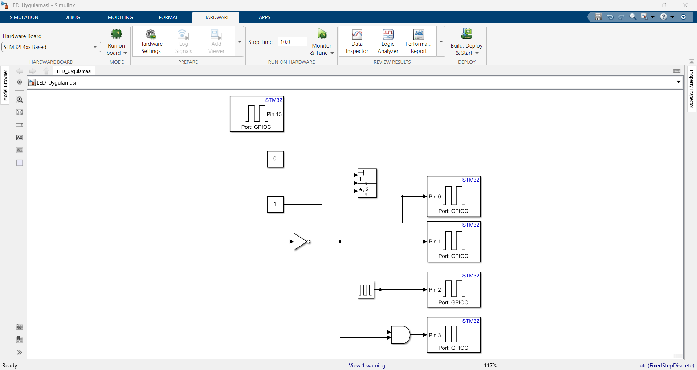
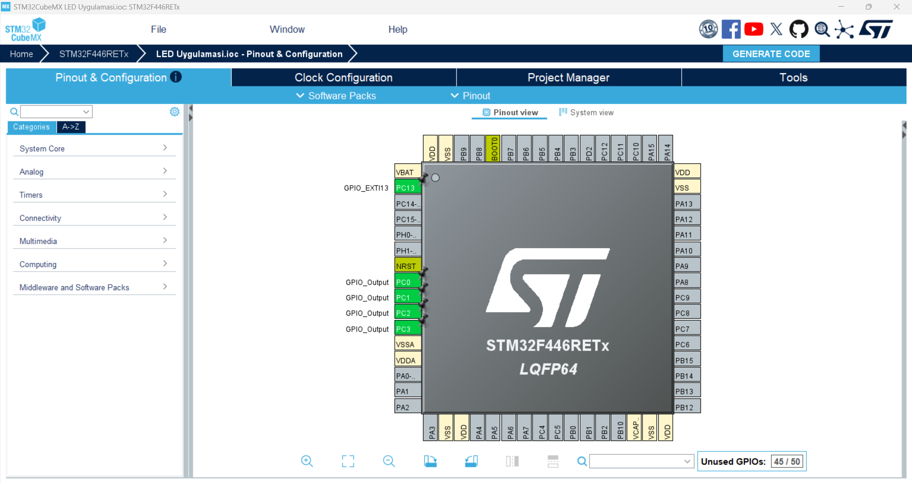
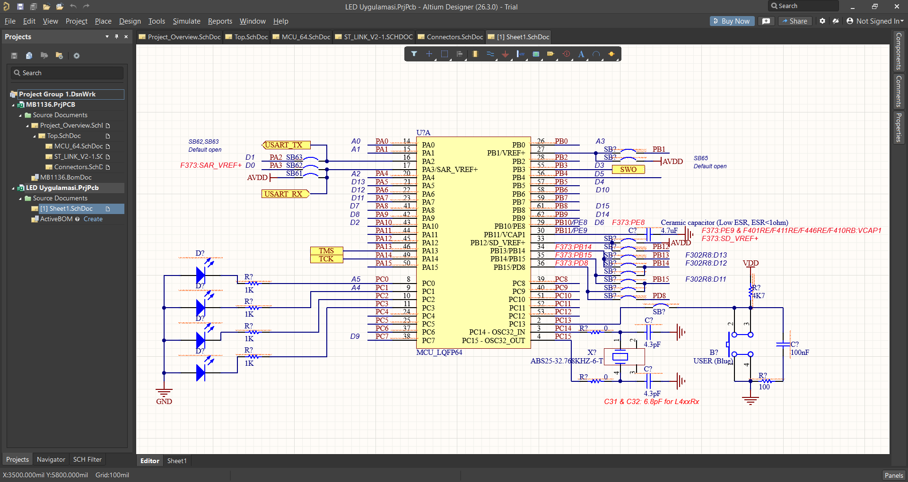

# STM32 MATLAB Project Template

## Project Overview
This project is a template for developing STM32 microcontroller applications using MATLAB/Simulink and STM32CubeIDE. It includes generated code, configuration files, and example implementations for LED control and GPIO operations.

### Key Features:
- **MATLAB/Simulink Integration**: Code generated from Simulink models.
- **STM32CubeIDE Compatibility**: Includes STM32CubeIDE project files.
- **LED Control Example**: Demonstrates GPIO operations for LED toggling.
- **HAL and LL Drivers**: Utilizes STM32 HAL and LL drivers.

## Project Structure
- **Core/**: Contains the main application code and headers.
  - `main.c`: Entry point of the application.
  - `main.h`: Header file for main.c.
- **Drivers/**: STM32 HAL and CMSIS drivers.
- **LED_Uygulamasi_ert_rtw/**: Generated code from Simulink.
  - `LED_Uygulamasi.c`: Core logic generated from the Simulink model.
  - `LED_Uygulamasi.h`: Header file for the generated code.
- **STM32CubeIDE/**: STM32CubeIDE project files.
- **Screenshots**: Example screenshots of the project.

## Screenshots

## How to Use
1. Open the project in STM32CubeIDE.
2. Build the project to generate the firmware.
3. Flash the firmware onto the STM32 microcontroller.
4. Use the Simulink model `LED_Uygulamasi.slx` to modify the application logic.

## License
This project is licensed under the GNU Affero General Public License v3.0. See the LICENSE file for details.

---
Generated by Barış KAÇİN.